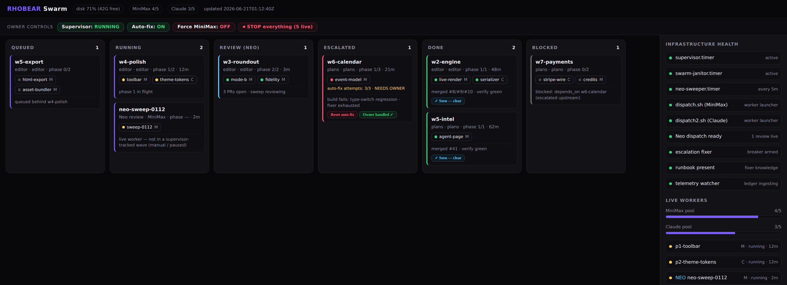
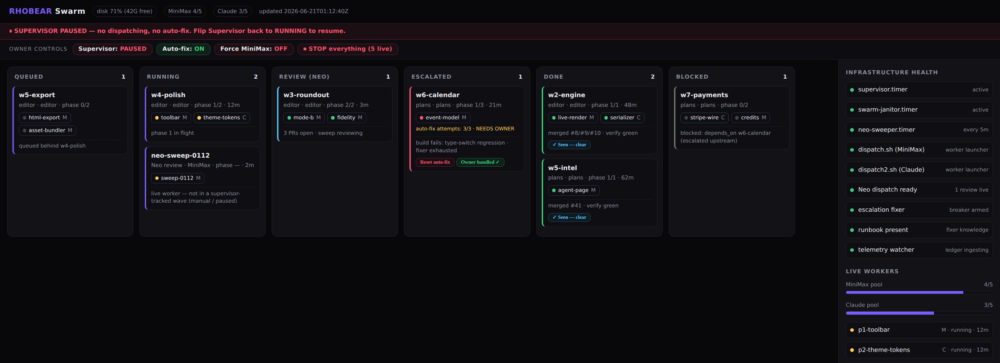

# RHOBEAR Orchestration

> **Patterns for running a self-driving swarm of coding agents** — dispatch, auto-review, self-heal, and an audit trail, with no human in the progression loop.

This repo documents how we run a fleet of AI coding agents that pick up work, write code, review each other, merge what passes, fix what breaks, and report back — continuously, while we sleep. We're giving the **patterns** away for free. (The running system stays ours; the ideas are yours to copy.)

It is built on three load-bearing beliefs:

1. **The progression loop must be deterministic.** Deciding *"phase N is done, dispatch phase N+1"* is plain code, never an LLM call. Models do the creative work (writing code, reviewing, unsticking); rules move the line. This is what makes it cheap, debuggable, and impossible to confuse.
2. **No single model or provider is a point of failure.** Work routes across two providers. When one is at capacity or out of tokens, the system reroutes or holds *that pool only* — the other keeps moving.
3. **Every state change leaves proof.** A worker can't "finish" silently. Merges, reviews, escalations, and wakes all write durable records — so "is it actually working?" is answerable by reading a file, not by trusting a vibe.

---

## The five patterns

| # | Pattern | One line |
|---|---------|----------|
| 1 | **Deterministic supervisor** | A 30-second tick with **zero LLM** in the progression loop decides what runs next. |
| 2 | **Capacity-aware model routing** | When the MiniMax pool is full, work auto-falls to Claude — and a force-toggle can pin everything to one provider. |
| 3 | **Auto-review by sweep** | Instead of one reviewer per PR, a **sweeper** batches every open PR and fires a single reviewer ("Neo") that reviews → fixes bot findings → merges on green. |
| 4 | **The async architect** | A human-facing agent that **wakes on state-change**, audits what happened, and writes the record — it gates nothing, it just keeps the human's mental model in sync. |
| 5 | **Quota & zombie resilience** | Per-pool holds on token exhaustion, a circuit breaker on the auto-fixer, and the hard-won lesson that a hung worker was a *telemetry plugin*, not the model. |

Each has its own page in [`docs/`](docs/).

## The diagrams

Four Mermaid flowcharts (GitHub renders them inline) in [`docs/architecture.md`](docs/architecture.md):

1. **Claude lane** — how a Claude worker is dispatched and run
2. **MiniMax lane** — how a MiniMax worker is dispatched and run
3. **The watcher** — per-turn token telemetry, read at arm's length so a dead backend can never hang a worker
4. **The whole web** — every piece wired together in one picture

## The proof

We don't ask you to take "it works" on faith. [`docs/proof.md`](docs/proof.md) shows a real night of the async architect waking on each merge and writing its audit — including one entry where it *detected a duplicate notification and refused to double-write*.

## The board

A live kanban (Queued → Running → Review → Escalated → Done) with owner kill-switches and a token meter.

The **Escalated** card (`auto-fix attempts: 3/3 · NEEDS OWNER`) is the system admitting it's stuck instead of thrashing; the **Blocked** card is a wave refusing to start because its upstream broke. Owner controls can stop the whole thing cold:

---

## Why give it away?

Most "agent swarm" demos are a single agent in a `while` loop with a confident README. The hard parts are the unglamorous ones: what happens when a provider runs out of tokens at 2am, how you stop a worker that's looping in the wrong file, how you know it actually merged something. Those are the patterns here. If they save you a week, point someone our way.

## License

Documentation and diagrams: [CC BY 4.0](LICENSE). Copy, adapt, share — just keep the attribution.
