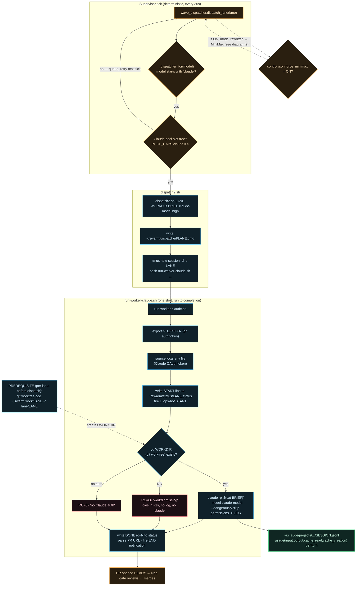
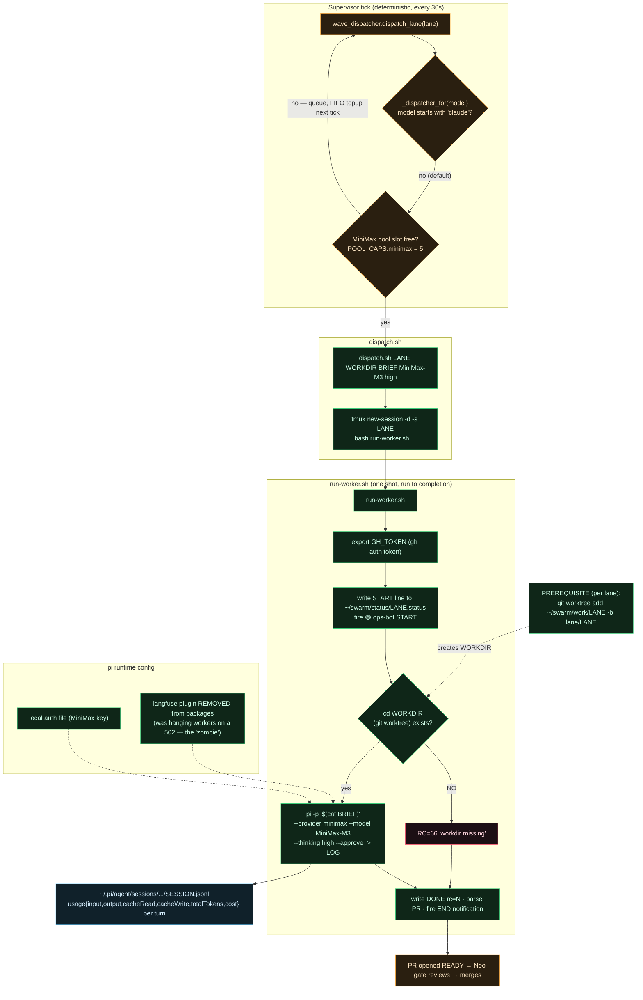
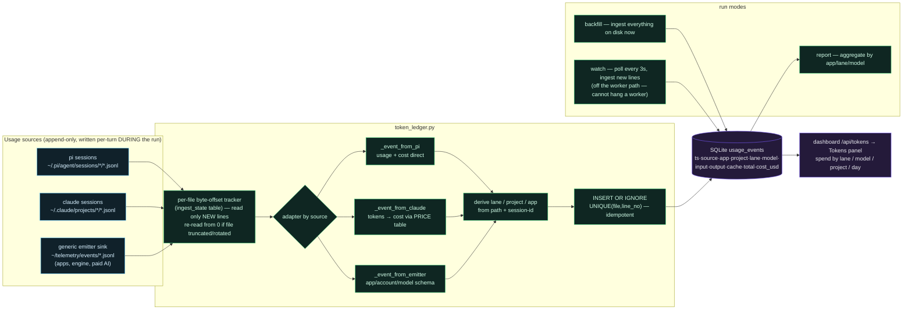
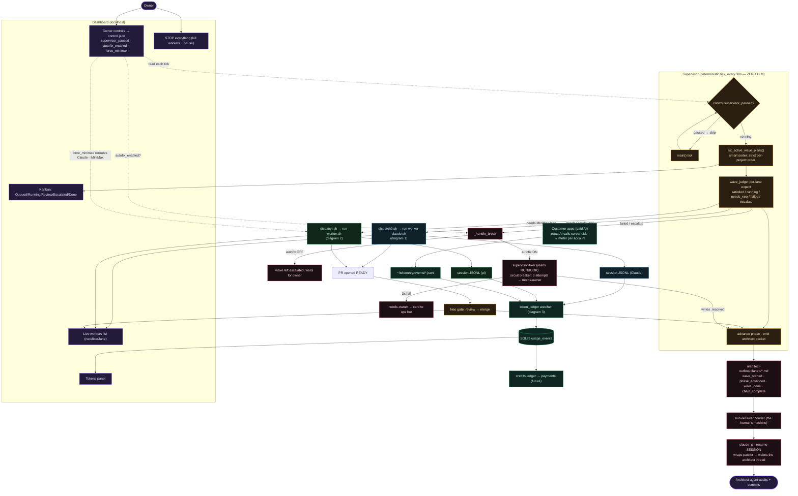

# Architecture

Four Mermaid flowcharts describing the swarm. Paste any block into a Mermaid renderer (GitHub renders them natively, or [mermaid.live](https://mermaid.live)).

1. **Claude lane** — how a Claude worker is dispatched and run
2. **MiniMax lane** — how a MiniMax worker is dispatched and run
3. **The watcher** — per-turn token telemetry (reads what 1 & 2 write)
4. **The whole web** — everything wired together

Colour legend (consistent across all four):
🟪 owner / control · 🟧 supervisor core · 🟦 Claude path · 🟩 MiniMax path · 🟦‍🟩 telemetry · 🟥 escalation/courier

The whole thing runs on a single orchestrator host. Paths below are generic (`~/swarm`, `~/.claude`, etc.); names of hosts, accounts, and tokens are deliberately omitted.

---

## 1. Claude lane — `dispatch2.sh` → `run-worker-claude.sh`

**Key facts**
- The Claude worker authenticates from a local env file holding an OAuth token tied to a Claude **subscription**, not a metered API key.
- `rc=66` = the worktree directory didn't exist → `claude` never even started. This is the single most common false "Claude is broken" — it's a missing `git worktree add`, not a quota/limit.
- Each turn's token usage is written to the session JSONL **during** the run (the telemetry source — diagram 3).

---

## 2. MiniMax lane — `dispatch.sh` → `run-worker.sh`

**Key facts**
- `pi` is hardcoded to `--provider minimax`; the model string only chooses the MiniMax variant. `dispatch.sh` can never reach Claude — provider choice is a *dispatcher* decision, not a worker one.
- **The zombie fix:** a telemetry plugin was removed from the agent config. When the self-hosted telemetry backend returned a 502, that plugin's exit-flush hung the worker at 0% CPU. It was misread as a "model API crash" for three debugging sessions. The agent now exits clean in ~3s. *Lesson: a hung worker is far more often your own observability sidecar than the model.*
- Same session-JSONL telemetry shape as Claude, but the MiniMax runtime also writes a per-turn **cost** field (Claude usage is priced by a local table — diagram 3).

---

## 3. The watcher — token-ledger telemetry

**Key facts**
- Usage is appended to the session JSONL **line-by-line, ~1–2s after each turn, while the process is still alive** — so a live meter works without waiting for a session to close.
- The watcher reads files **an arm's length from the workers**, so a telemetry backend going down can never hang a worker (the lesson from the zombie above).
- The same `usage_events` schema accepts a **generic emitter** sink — that's where a customer billing meter plugs in, keyed by `account_id`.

---

## 4. The whole web — everything wired together

**Reading it in one breath:** the owner sets toggles on the board → the deterministic supervisor reads them each tick, surfaces eligible waves, and dispatches workers down the Claude or MiniMax path (force-MiniMax can reroute). Workers open PRs that Neo reviews and merges; breakage is auto-fixed by a capped fixer (or handed to the owner). Every state change couriers a packet that wakes the architect agent to audit. Meanwhile every worker's token usage flows from its session JSONL into the ledger and back onto the board — and the same ledger is where customer billing plugs in.
